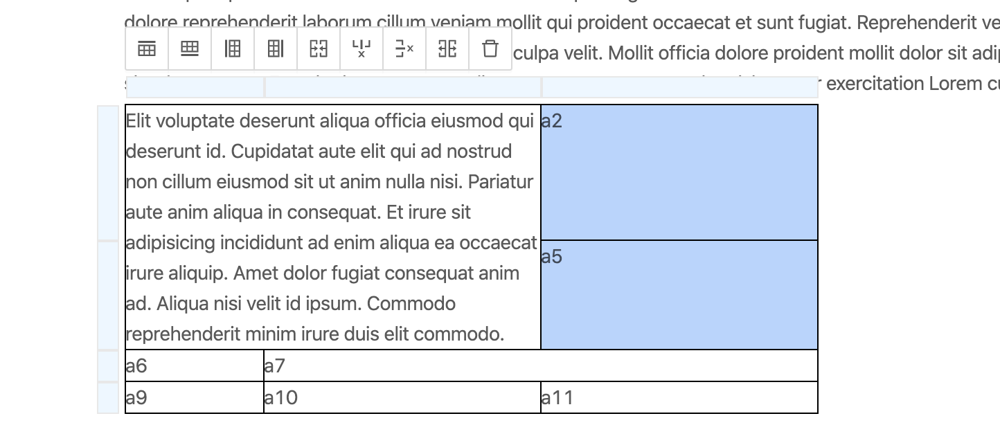

# Slate-table

A pretty Slate.js table plugin (Slate.js version > 0.5)

Online demo: [https://slate-table.now.sh](https://slate-table.now.sh)

features:
- Resize height and width
- Append row, column below, above, left and right
- Remove rows, columns
- Merge selected cells
- Split selected cells

### License
MIT.
